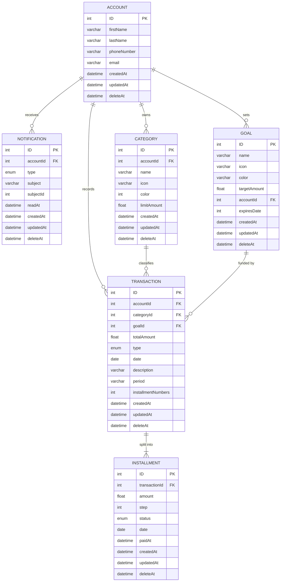

# FlowFi — Data Model (ERD)

Target schema for the `Ledger` domain slice (plus notifications). Implemented
so far: the `Identity` slice (`users`, `otp_codes`, `personal_access_tokens`)
and, from `Ledger`, `goals` and `categories`. Each "Status" line below records
how a drawn entity was realized.

`ACCOUNT` is the evolution of the current `User` model
(`packages/backend/app/Domains/Identity/Models/User.php`) — `name` split into
`firstName`/`lastName`, plus `phoneNumber`.

Status: `ACCOUNT` is realized on the existing `users` table (no rename) as
`first_name`, `last_name`, `phone_number` and `deleted_at` (`SoftDeletes`).

Status: `GOAL` is realized as `goals` (`app/Domains/Ledger/Models/Goal.php`):
`accountId` → `user_id` (FK to `users.id`, indexed), `targetAmount` → integer
cents in `target_amount` (exposed as a decimal string through the `Money`
cast), `expiresDate` → nullable `date expires_at`, `color` → `#RRGGBB` string,
`deleteAt` → `deleted_at`. `name` is unique per user among live rows,
enforced in validation only (no DB unique index, so a soft-deleted name can
be reused).

Status: `CATEGORY` is realized as `categories`
(`app/Domains/Ledger/Models/Category.php`): `accountId` → `user_id` (FK to
`users.id`, indexed), `color` → `#RRGGBB` string (not `INT`), `deleteAt` →
`deleted_at`, plus one column not in the original drawing, `limitAmount` →
nullable integer cents in `limit_amount` behind the `Money` cast (the maximum
a user wants to allot to the category; null = no cap). `name` follows the
same per-user uniqueness rule as `GOAL`.

Status: `TRANSACTION` and `INSTALLMENT` are realized as `transactions` and
`installments` (`app/Domains/Ledger/Models/Transaction.php` and
`Installment.php`). `accountId` → `user_id` (FK, indexed, required);
`categoryId` → `category_id` (FK, indexed, required — kept mandatory, unlike
`goalId`, since nothing in the source drawing suggested otherwise); `goalId`
→ `goal_id` (FK, indexed, **nullable**, per the open point below);
`totalAmount`/`INSTALLMENT.amount` → integer cents behind `Money`, per the
open point below; `deleteAt` → `deleted_at` on both. `type` is validated
against `Transaction::TYPES` (`income`, `expense`) — an assumption, since the
source drawing left the enum's values undefined. `period` became the
`period_unit` (`day`/`week`/`month`/`year`, `Transaction::PERIOD_UNITS`) +
`period_interval` (positive integer) pair, resolving the "period looks
enum-shaped too" open point while still allowing e.g. "every 15 days".
`installmentNumbers` → `installments_count`, kept as a denormalized cache
written by `TransactionService` alongside the installments themselves (see
open point below on why it's a deliberate duplication, not an oversight).

One column not in the original drawing: `schedule_type`
(`single`/`periodic`/`custom`) records how the current installment plan was
produced — a single payment, an even split over `installments_count` spaced
by `period_unit`/`period_interval`, or an explicit list of
`{amount, date}` pairs with independent, non-uniform gaps between them. This
is what lets `POST /transactions` and `PATCH /transactions/{id}` support all
three ways of paying: one shot, N equal installments on a fixed cadence, or
N installments on entirely different schedules. `period_unit`/
`period_interval` are only populated when `schedule_type` is `periodic`;
they're `null` for `single` and `custom`. Editing a transaction re-derives
the whole schedule whenever any schedule-affecting field changes (amount,
installment count, period, or an explicit installment list), but is refused
(422) once any installment has actually been paid — see
`TransactionService::guardAgainstPaidInstallments()`.

## Cardinalities

Source diagram uses min-max pairs; the pair sits on the side it counts.

| Relationship | Reading |
|---|---|
| ACCOUNT → NOTIFICATION | 1 account has 0..n notifications |
| ACCOUNT → CATEGORY | 1 account has 0..n categories |
| ACCOUNT → GOAL | 1 account has 0..n goals |
| ACCOUNT → TRANSACTION | 1 account has 0..n transactions |
| CATEGORY → TRANSACTION | 1 category classifies 0..n transactions |
| GOAL → TRANSACTION | 1 goal is funded by 0..n transactions |
| TRANSACTION → INSTALLMENT | 1 transaction splits into 1..n installments |

The `TRANSACTION → INSTALLMENT` pair is `(1,1) (1,n)`; the drawing tool used for
the original diagram could not render `(1,n)` and showed `(0,n)` instead.

## Diagram

## Ownership notes

- `ACCOUNT` is the aggregate root. Every entity except `INSTALLMENT` carries
  `accountId` — that column is the tenant-isolation key for every query.
- `INSTALLMENT` reaches the account only through `TRANSACTION`: the payment
  schedule is transaction-local by design.
- `NOTIFICATION.subject` + `subjectId` is a polymorphic pointer (Laravel
  `morphTo`, i.e. `subject_type` / `subject_id`) — no FK constraint.
- `TRANSACTION` is the join point between classification (category),
  allocation (goal) and schedule (installments).
- Auth and tokens stay outside this model — Sanctum and the `Identity` slice.

## Open points

- `deleteAt` should be `deletedAt` (`deleted_at`) for Laravel `SoftDeletes`.
  Done for `ACCOUNT` (`users.deleted_at`), `GOAL` (`goals.deleted_at`),
  `CATEGORY` (`categories.deleted_at`), `TRANSACTION`
  (`transactions.deleted_at`) and `INSTALLMENT` (`installments.deleted_at`).
- `GOAL.expiresDate` is typed `INT` but named as a date. Resolved: nullable
  `date expires_at`.
- `color` is `INT` on `CATEGORY` and `VARCHAR` on `GOAL`. Resolved for both as
  a `#RRGGBB` string; they share the `AppearanceService`. The diagram keeps
  the original `int` on `CATEGORY` for fidelity to the source drawing.
- Money columns (`GOAL.targetAmount`, `CATEGORY.limitAmount`,
  `TRANSACTION.totalAmount`, `INSTALLMENT.amount`) are drawn as `FLOAT`.
  Resolved for all four as integer cents behind the shared `Money` cast,
  which now also exposes `Money::toCents()`/`Money::toDecimal()` as static
  helpers so `InstallmentPlanner` can split and sum amounts without floats.
- `CATEGORY.limitAmount` has no period attached (per month? total?). Still
  open — comparing spend against it is future work, not part of this slice.
- `TRANSACTION.goalId` is drawn mandatory `(1,1)`; resolved as nullable
  `(0,1)` (`goal_id` nullable, `nullOnDelete()`), since most transactions
  have no goal. `category_id` stayed mandatory.
- `TRANSACTION.installmentNumbers` duplicates `COUNT(INSTALLMENT)`. Resolved
  as a deliberate denormalization (`installments_count`): it's always
  written by `TransactionService` in the same DB transaction that replaces
  the installments, so it never drifts, and it lets the transaction list
  show a count without an eager-loaded `installments` relation.
- `TRANSACTION.period` is `VARCHAR` while `type` is `ENUM`; period looks
  enum-shaped too. Resolved as `period_unit` (enum-like,
  `Transaction::PERIOD_UNITS`) + `period_interval` (integer multiplier).
- `ACCOUNT` carries no `password` / `email_verified_at`. Resolved: `ACCOUNT`
  stayed on `users`; `password` was dropped (auth is OTP-only, codes live in
  `otp_codes`) and `email_verified_at` is kept and set when a code is verified.
- `TRANSACTION.type`'s enum values were never specified in the source
  drawing. Assumed `income` / `expense` (`Transaction::TYPES`) as the
  minimum FlowFi needs; revisit if the product calls for more (e.g. transfer).
