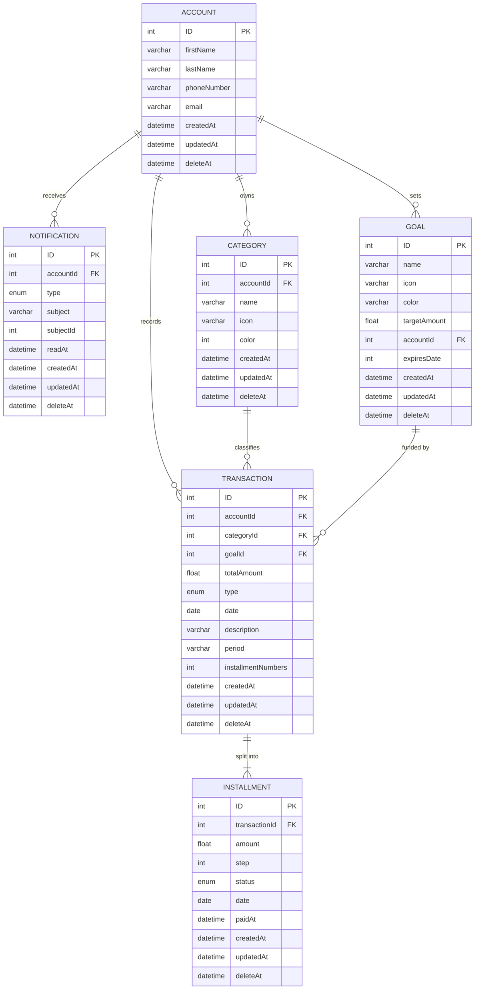

# FlowFi — Data Model (ERD)

Target schema for the `Ledger` domain slice (plus notifications). Not yet
implemented: today only the `Identity` slice exists (`users`, `sessions`,
`password_reset_tokens`, `personal_access_tokens`).

`ACCOUNT` is the evolution of the current `User` model
(`packages/backend/app/Domains/Identity/Models/User.php`) — `name` split into
`firstName`/`lastName`, plus `phoneNumber`.

Status: `ACCOUNT` is realized on the existing `users` table (no rename) as
`first_name`, `last_name`, `phone_number` and `deleted_at` (`SoftDeletes`).

## Cardinalities

Source diagram uses min-max pairs; the pair sits on the side it counts.

| Relationship | Reading |
|---|---|
| ACCOUNT → NOTIFICATION | 1 account has 0..n notifications |
| ACCOUNT → CATEGORY | 1 account has 0..n categories |
| ACCOUNT → GOAL | 1 account has 0..n goals |
| ACCOUNT → TRANSACTION | 1 account has 0..n transactions |
| CATEGORY → TRANSACTION | 1 category classifies 0..n transactions |
| GOAL → TRANSACTION | 1 goal is funded by 0..n transactions |
| TRANSACTION → INSTALLMENT | 1 transaction splits into 1..n installments |

The `TRANSACTION → INSTALLMENT` pair is `(1,1) (1,n)`; the drawing tool used for
the original diagram could not render `(1,n)` and showed `(0,n)` instead.

## Diagram

## Ownership notes

- `ACCOUNT` is the aggregate root. Every entity except `INSTALLMENT` carries
  `accountId` — that column is the tenant-isolation key for every query.
- `INSTALLMENT` reaches the account only through `TRANSACTION`: the payment
  schedule is transaction-local by design.
- `NOTIFICATION.subject` + `subjectId` is a polymorphic pointer (Laravel
  `morphTo`, i.e. `subject_type` / `subject_id`) — no FK constraint.
- `TRANSACTION` is the join point between classification (category),
  allocation (goal) and schedule (installments).
- Auth and tokens stay outside this model — Sanctum and the `Identity` slice.

## Open points

- `deleteAt` should be `deletedAt` (`deleted_at`) for Laravel `SoftDeletes`.
  Done for `ACCOUNT` (`users.deleted_at`); still applies to the other entities.
- `GOAL.expiresDate` is typed `INT` but named as a date.
- `color` is `INT` on `CATEGORY` and `VARCHAR` on `GOAL`.
- `TRANSACTION.goalId` is drawn mandatory `(1,1)`; most transactions have no
  goal, so it likely wants to be nullable `(0,1)`.
- `TRANSACTION.installmentNumbers` duplicates `COUNT(INSTALLMENT)`.
- `TRANSACTION.period` is `VARCHAR` while `type` is `ENUM`; period looks
  enum-shaped too.
- `ACCOUNT` carries no `password` / `email_verified_at`. Resolved: `ACCOUNT`
  stayed on `users`; `password` was dropped (auth is OTP-only, codes live in
  `otp_codes`) and `email_verified_at` is kept and set when a code is verified.
